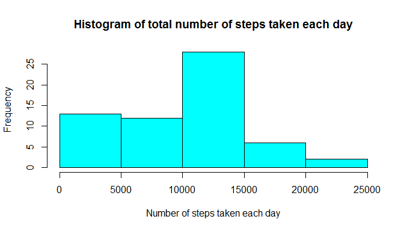
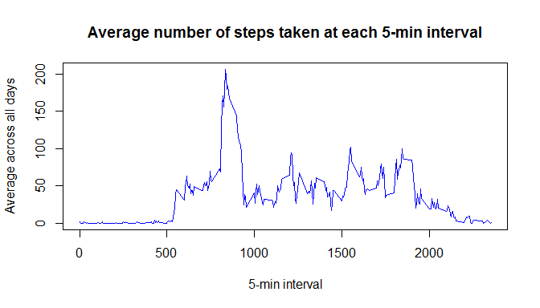
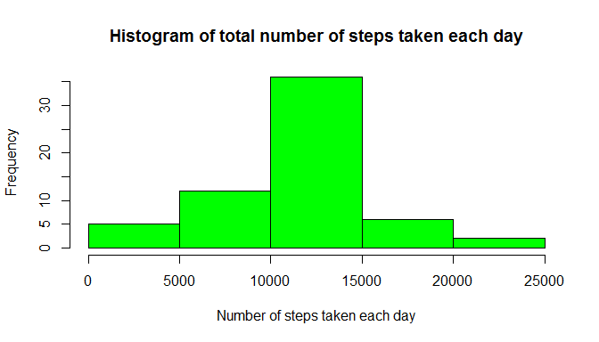
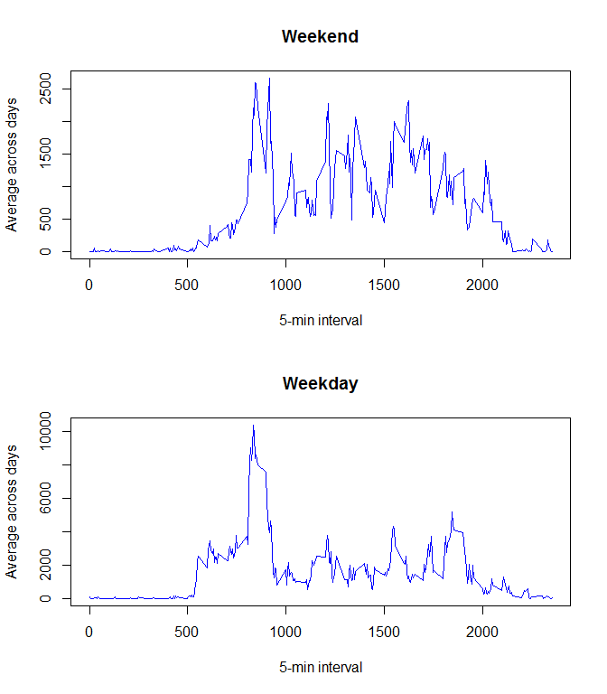

# Reproducible Research: Peer Assessment 1


## Loading and 
1. Load the data (i.e. read.csv())
2. Process/transform the data (if necessary) into a format suitable for your analysis

```r
setwd("C:/Users/hmiyake/Documents/RepData_PeerAssignmen1")
df <- read.csv("activity.csv")

cat("Total Records: ", nrow(dt), sep="")
```

```
## Total Records: 17568
```

## What is mean total number of steps taken per day?

1. Make a histogram of the total number of steps taken each day

```r
df.hist <- data.frame(tapply(df$steps, df$date, FUN=sum, na.rm=TRUE))
colnames(df.hist) <- "steps"
hist(df.hist$steps,
     main="Histogram of total number of steps taken each day", 
     xlab="Number of steps taken each day",
     col="cyan"
    )
```

 

2. Calculate and report the mean and median total number of steps taken per day

```r
cat("Mean: ", mean(df.hist$steps, na.rm=TRUE), "\n",
    "Median: ", median(df.hist$steps, na.rm=TRUE), sep="")
```

```
## Mean: 9354.23
## Median: 10395
```


## What is the average daily activity pattern?

1. Make a time series plot (i.e. type = "l") of the 5-minute interval (x-axis) and the average number of steps taken, averaged across all days (y-axis)


```r
df.pattern <- data.frame(tapply(df$steps, df$interval, FUN=mean, na.rm=TRUE))
colnames(df.pattern) <- "steps"
plot(row.names(df.pattern), df.pattern$steps, type="l", col="blue",
     main="Average number of steps taken at each 5-min interval",
     xlab="5-min interval",
     ylab="Average across all days"
    )
```

 


2. Which 5-minute interval, on average across all the days in the dataset, contains the maximum number of steps?

```r
max_interval <- which.max(df.pattern$steps)
names(df.pattern[max_interval,])
```

```
## [1] "835"
```


## Imputing missing values

1. Calculate and report the total number of missing values in the dataset (i.e. the total number of rows with NAs)


```r
cat("Total NA: ", sum(is.na(df$steps)), sep="")
```

```
## Total NA: 2304
```

2. Devise a strategy for filling in all of the missing values in the dataset. The strategy does not need to be sophisticated. For example, you could use the mean/median for that day, or the mean for that 5-minute interval, etc.

3. Create a new dataset that is equal to the original dataset but with the missing data filled in.

Using mean for that 5-minute interval to replace any records with NA steps

```r
df2 <- df
    for (i in 1:nrow(df2)) {
        if (is.na(df2$steps[i])) {
            df2$steps[i] <- as.integer(df.pattern$steps[which(row.names(df.pattern) == df2$interval[i])])
        }
    }
cat("Total NA: ", sum(is.na(df2$steps)), sep="")
```

```
## Total NA: 0
```


4. Make a histogram of the total number of steps taken each day and Calculate and report the mean and median total number of steps taken per day. Do these values differ from the estimates from the first part of the assignment? What is the impact of imputing missing data on the estimates of the total daily number of steps?


```r
df2.hist <- data.frame(tapply(df2$steps, df2$date, FUN=sum, na.rm=FALSE))
colnames(df2.hist) <- "steps"
hist(df2.hist$steps,
     main="Histogram of total number of steps taken each day", 
     xlab="Number of steps taken each day",
     col="green"
    )
```

 

Mean and median ***before*** imputing missing values

```r
cat("Mean: ", mean(df.hist$steps), "\n",
    "Median: ", median(df.hist$steps))
```

```
## Mean:  9354.23 
##  Median:  10395
```

Mean and median ***after*** imputing missing values

```r
cat("Mean: ", mean(df2.hist$steps), "\n",
    "Median: ", median(df2.hist$steps))
```

```
## Mean:  10749.77 
##  Median:  10641
```

## Are there differences in activity patterns between weekdays and weekends?

1. Create a new factor variable in the dataset with two levels - "weekday" and "weekend" indicating whether a given date is a weekday or weekend day.


```r
df2.dayofweek <- data.frame(factor(weekdays(as.Date(df2$date))))
colnames(df2.dayofweek) <- "weekday"
df2.dayofweek2 <- data.frame(factor(weekdays(as.Date(df2$date)),
                                   levels=c("Sunday","Monday","Tuesday", "Wednesday","Thursday","Friday","Saturday"),
                                   labels=c("Weekend","Weekday","Weekday","Weekday","Weekday","Weekday","Weekend")))
colnames(df2.dayofweek2) <- "weekday2"

df2 <- cbind(df2,df2.dayofweek, df2.dayofweek2)

df2.wday <- subset(df2, df2$weekday2=="Weekday")
df2.wend <- subset(df2, df2$weekday2=="Weekend")

df2.wday.pattern <- data.frame(tapply(df2.wday$steps, df2.wday$interval, FUN=sum, na.rm=FALSE))
colnames(df2.wday.pattern) <- "steps"
df2.wend.pattern <- data.frame(tapply(df2.wend$steps, df2.wend$interval, FUN=sum, na.rm=FALSE))
colnames(df2.wend.pattern) <- "steps"
```


2. Make a panel plot containing a time series plot (i.e. type = "l") of the 5-minute interval (x-axis) and the average number of steps taken, averaged across all weekday days or weekend days (y-axis). See the README file in the GitHub repository to see an example of what this plot should look like using simulated data

Average number of steps taken at each 5-min interval

```r
par(mfrow=c(2,1))

plot(row.names(df2.wend.pattern), df2.wend.pattern$steps, type="l", col="blue",
     main="Weekend",
          xlab="5-min interval",
     ylab="Average across days"
)
plot(row.names(df2.wday.pattern), df2.wday.pattern$steps, type="l", col="blue",
     main="Weekday",
     xlab="5-min interval",
     ylab="Average across days"
)
```

 

```r
#title("Average number of steps taken at each 5-min interval", outer=TRUE)
```

